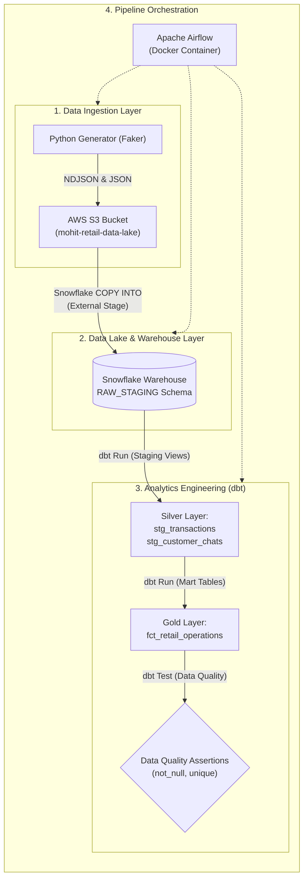

# ☁️ Cloud Retail Analytics Data Infrastructure Pipeline


An end-to-end, production-ready **Cloud ELT Data Pipeline** that streams synthetic e-commerce transactional data and unstructured customer support chat logs into an **AWS S3 Data Lake**, bulk loads records into a **Snowflake Data Warehouse**, executes analytics transformations and data quality assertions using **dbt Core**, and orchestrates execution end-to-end with **Apache Airflow inside Docker**.

---

## 🗺️ Architecture Overview



---

## ✨ Key Features & Technical Highlights

* **Automated Data Streaming to S3**: Streams structured sales events and unstructured customer support logs in **Newline-Delimited JSON (NDJSON)** to AWS S3 using `boto3`.
* **Snowflake Parallel Warehouse Bulk Loading**: Leverages Snowflake's `COPY INTO` command with `MATCH_BY_COLUMN_NAME = CASE_INSENSITIVE` and `STRIP_OUTER_ARRAY = TRUE` for high-throughput schema-on-read ingestion.
* **dbt Dimensional & Variant Modeling**:
  * **Staging Layer (Silver)**: Standardizes product categories, calculates total order metrics, flags high-value deals, and extracts JSON variant fields using `:path` notation.
  * **Marts Layer (Gold)**: Joins facts with chat transcripts to run warehouse-native keyword sentiment classification (`CRITICAL ESCALATION`, `POSITIVE FEEDBACK`, `GENERAL ENQUIRY`).
* **Automated Data Quality Testing**: Enforces constraints (`unique`, `not_null`) using `dbt test` to prevent data quality regressions.
* **Dockerized Airflow Scheduling**: Runs an Airflow cluster (Webserver + Scheduler + PostgreSQL metadata DB) via Docker Compose on a 10-minute automated schedule.

---

## 📁 Repository Structure

```
cloud_data_pipeline/
├── dags/
│   ├── retail_pipeline_dag.py        # Main Airflow DAG defining task execution graph
│   └── retail_transformation/        # dbt Core Project Directory
│       ├── dbt_project.yml           # dbt project configurations & materialization rules
│       ├── profiles.yml              # Snowflake connection profile
│       └── models/
│           ├── schema.yml            # Data sources and quality test constraints
│           ├── staging/              # Staging Models (stg_transactions, stg_customer_chats)
│           └── marts/                # Analytical Mart Models (fct_retail_operations)
├── .env.example                      # Template for AWS & Snowflake environment credentials
├── .gitignore                        # Git exclusion rules for secrets and build artifacts
├── docker-compose.yml                # Airflow multi-container orchestration stack
├── requirements.txt                  # Python dependencies
└── README.md                         # Project documentation
```

---

## ⚙️ Environment & Credentials Setup

1. **Clone the Repository**:
   ```bash
   git clone https://github.com/mohitverma777/retail_cloud_data_pipeline.git
   cd cloud_data_pipeline
   ```

2. **Configure Environment Variables**:
   Copy `.env.example` to create your local `.env` file:
   ```bash
   cp .env.example .env
   ```

3. **Fill in Credentials in `.env`**:
   ```env
   # AWS Configuration
   AWS_ACCESS_KEY=your_aws_access_key_here
   AWS_SECRET_KEY=your_aws_secret_key_here
   AWS_BUCKET_NAME=your_s3_bucket_name_here

   # Snowflake Configuration
   SNOWFLAKE_USER=your_snowflake_username
   SNOWFLAKE_PASSWORD=your_snowflake_password
   SNOWFLAKE_ACCOUNT=your_snowflake_account_identifier
   SNOWFLAKE_WAREHOUSE=COMPUTE_WH
   SNOWFLAKE_DATABASE=RETAIL_ANALYTICS_DB
   SNOWFLAKE_SCHEMA=RAW_STAGING
   SNOWFLAKE_ROLE=ACCOUNTADMIN
   ```

---

## 🚀 Running the Pipeline

### Option 1: Launching via Docker Compose (Recommended)

Start Apache Airflow and PostgreSQL metadata database:
```bash
docker compose up -d
```

Access the Airflow Web UI in your browser:
* **URL**: `http://localhost:8080`
* **Username**: `airflow`
* **Password**: `airflow`

The DAG `cloud_retail_s3_data_lake_pipeline` will trigger automatically according to its schedule:
`generate_and_stage_to_amazon_s3` ➔ `bulk_load_s3_to_snowflake` ➔ `run_dbt_transformations` ➔ `run_dbt_quality_tests`

### Option 2: Running dbt Locally

If you have `dbt-snowflake` installed locally:
```bash
# Navigate to dbt project directory
cd dags/retail_transformation

# Run models
dbt run --profiles-dir .

# Run quality tests
dbt test --profiles-dir .
```

---

## 📊 Analytics Modeling (dbt)

### 1. Staging Layer (`models/staging/`)
* **`stg_transactions.sql`**: Cleans raw transactions, standardizes text capitalization via `INITCAP()`, calculates `total_order_value`, and flags transactions > $300.
* **`stg_customer_chats.sql`**: Extracts semi-structured text logs and mobile OS attributes directly from Snowflake JSON Variant payloads (`$1:text_log`, `$1:origin_device`).

### 2. Marts Layer (`models/marts/`)
* **`fct_retail_operations.sql`**: Combines sales transactions and support logs, categorizing customer interaction sentiment into operational categories (`CRITICAL ESCALATION`, `POSITIVE FEEDBACK`, `GENERAL ENQUIRY`).

---

## 📝 Resume Impact Summary

* **End-to-End Cloud Data Infrastructure**: Architected a scalable ELT data pipeline integrating Python, AWS S3, Snowflake, dbt Core, and Apache Airflow.
* **Semi-Structured & Variant Data Processing**: Built Snowflake schema-on-read ingestion to parse JSON variant structures into structured analytical data models.
* **Data Quality & Automated Testing**: Implemented dbt data assertions (`unique`, `not_null`) ensuring automated data quality validation across data marts.
* **Containerized Workflow Orchestration**: Deployed pipeline components using Docker Compose with automated retries and task dependency tracking.

---

## 📜 License

Distributed under the MIT License. See `LICENSE` for more information.
